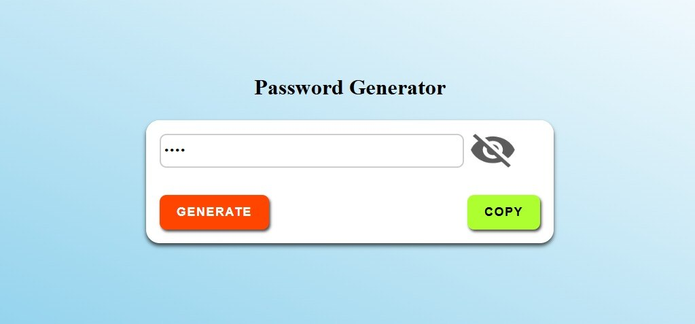
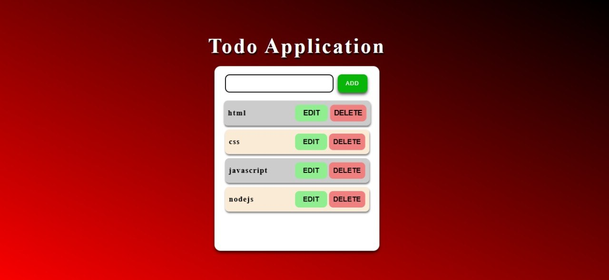
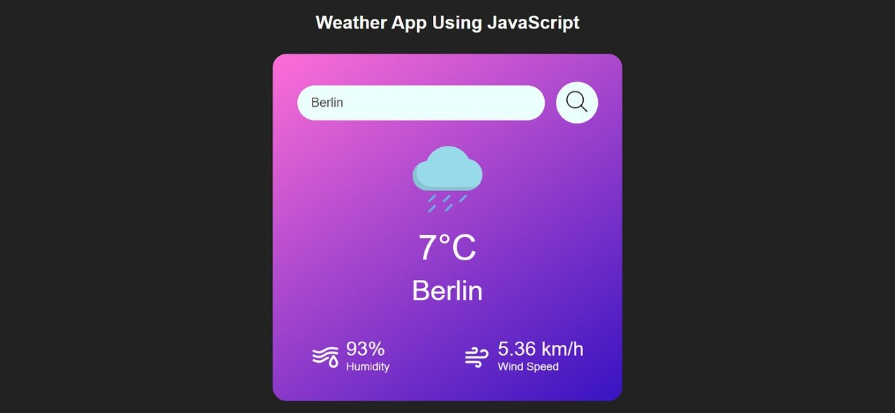
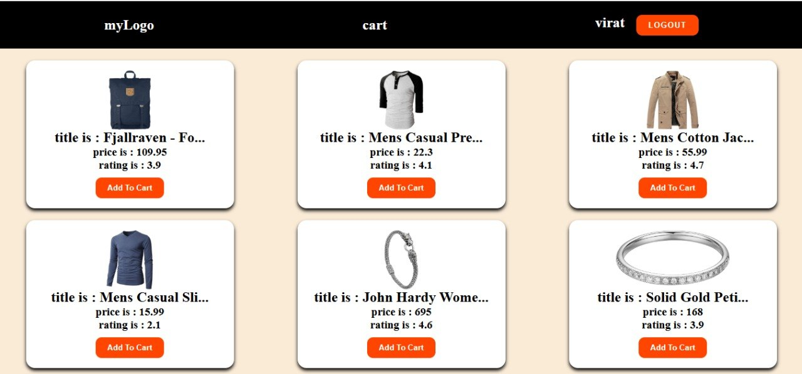

<!DOCTYPE html>
<html lang="en">
<head>
    <meta charset="UTF-8">
    <meta name="viewport" content="width=device-width, initial-scale=1.0">
    <title>My Portfolio</title>
    <!-- <link rel="stylesheet" href="./style.css"> -->
     
</head>
<body>
    <!-- nav part -->
    <nav>
        <h1 class="logo">My_Portfolio</h1>
        <ul>
            <li><a href="#home">home</a></li>
            <li><a href="#about">about</a></li>
            <li><a href="#project">project</a></li>
            <li><a href="#contact">contact</a></li>
        </ul>

        <button>contact me</button>
    </nav>
    <!-- hero part -->
    <main id="home" >
        <aside class="left" >
            <h3 >Hello ,</h3>
            <h1>I'm Elizabeth Rani </h1>
            <h2>Website Designer</h2>
            
To pursue a challenging position where I can utilize my knowledge, skills, and experience to contribute to the success
                    of the organization while fostering my professional growth.

            <button>Hire me</button>
        </aside>
        <aside class="right">
            
        </aside>
        
    </main>
    <section id="about">
        <h1>What can i do</h1>
        
I am Skilled in these topics

            

                <h2>UI/UX Design</h2>
                
Creative UI/UX designer with 2+ years of experience crafting intuitive interfaces and delightful experiences. Skilled in Figma, Sketch, user research, and prototyping. Passionate about solving user problems through design thinking."

            

            

                <h2>Website Design </h2>
                
Website designer with expertise in responsive design, HTML/CSS, and CMS platforms like WordPress. Proven track record of boosting engagement and conversions through user-centric designs. Focused on performance, accessibility, and clean code.

            

            

                <h2>Java Programming</h2>
                
Java developer with 3+ years of experience building scalable backend systems and Android apps. Proficient in Spring Boot, Hibernate, and Java 8 features. Passionate about clean code, problem-solving, and learning new tech.

            

            

                <h2>Database </h2>
                
Data-driven database expert with 3+ years optimizing, and managing SQL/NoSQL databases. Skilled in MySQL, MongoDB, PostgreSQL, and data modelinggreSQL, and data modeling. Passionate about performance tuning, data security, and scalable solutions.

            

        </section>
        <!-- project -->

        <section id="project" >
            <h1>my projects</h1>
            
I have prior experience in Android app development, and I am now seeking job opportunities in the app development field. Please let me know if there are any vacancies in your company that match my profile.

            

                

                
                <h3>Password generator</h3>
                
Developed a secure password generator app that creates strong, customizable passwords. Features include length selection, character type options (uppercase, lowercase, numbers, symbols), and copy-to-clipboard functionality. Built with [tech stack, e.g., JavaScript, React, Python] focusing on security and user experience.

                

            
                 

                    
                    <h3>Todo App</h3>
                    
Built a feature-rich Todo app to manage tasks efficiently. Key features: add, edit, delete, and mark tasks as complete; task filtering and search; responsive UI. Implemented with Node.js focusing on CRUD operations and intuitive UX.

                 

                

                    
                    <h3>Weather App</h3>
                    
Developed a real-time weather app providing current conditions and forecasts. Features include location-based search, temperature units toggle (°C/°F), and dynamic UI updates. Integrated with OpenWeatherMap API, built with  React, JavaScript, CSS. Focused on clean UI and accurate data display.

                

                

                    
                    <h3>Ecommerce App Project</h3>
                    
Built a full-stack ecommerce platform enabling product browsing, cart management, and secure checkout. Features: product search/filter, user auth, payment gateway integration (e.g., Stripe), order tracking. Tech stack:  Node.js, Express. Focused on UI/UX, scalability, and secure transactions.

                

            

        
        </section>

        <!-- contact  -->

        <section class="contact" id="contact">
            <h1>Contact Me</h1>
            
Please fill out the below form to discuss any work opportunities.

            
            <form action="">
                <input type="text" placeholder="Enter your Name">
                <input type="email" placeholder="Enter your Email">
                <textarea name="" id="" placeholder="Your Message"></textarea>
                <button>Submit</button>
            </form>
        </section>
        <!-- footer -->
         <footer>
            
Copyright &copy; My Portfolio.All Rights Resevered

         </footer>
</body>
</html>
